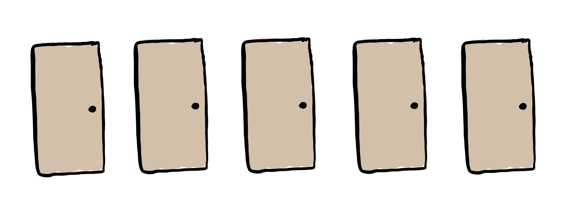
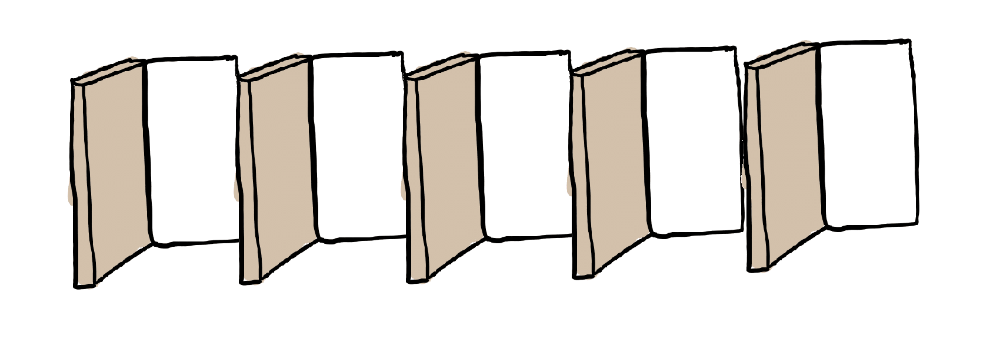
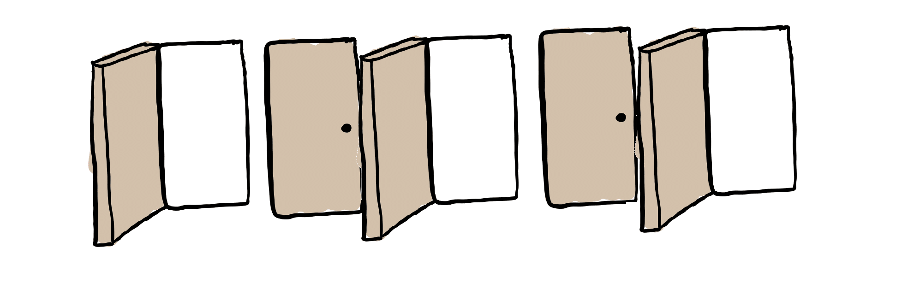

# 100Doors

We have a row of closed doors. For example:

If we visit every first door (in this case we only open it), the doors remain as follows:

Now, if we visit every, for example, second door, those door are going to be closed:

So, we have 3 open doors and 2 closed ones.

We want to answer the next question:

> 'If we have 100 doors, how do they remain if we visit in the 1st pass the 1st ones, in the 2nd pass, the 2nd ones, and so on, until the 100th door?'

Let's write code in SmallTalk using TDD to get the answer.

# Answer

If '@' stands for open door and '#' for closed, the answer is:

'@##@####@######@########@##########@############@##############@################@##################@'